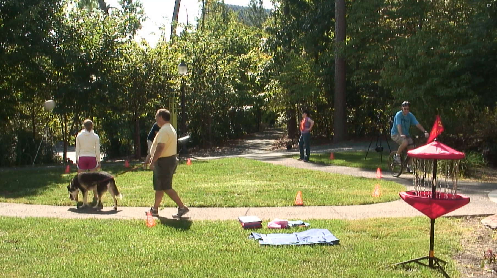
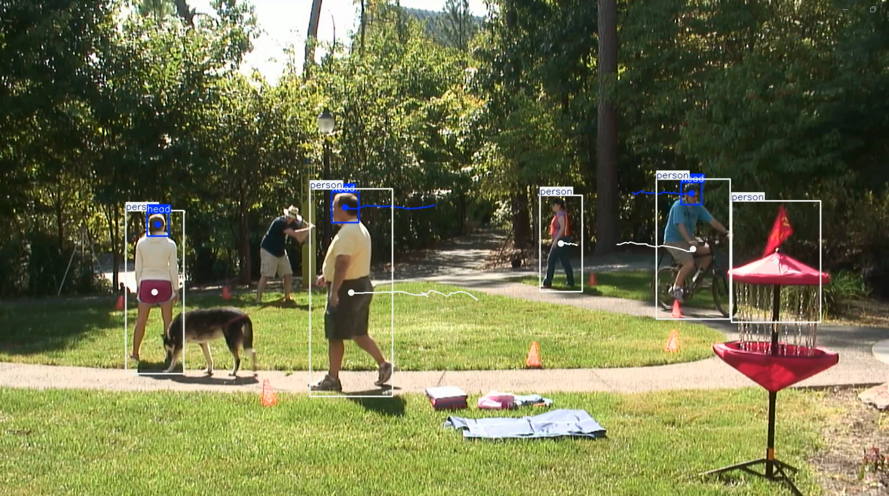

# Finetune_YOLOv11_for_Human_tracking_application
> This project demonstrates how to finetune YOLOv11 for a human tracking application

We train on a custom dataset with 3 classes: person, head, and object, then test the trained model on videos or live camera input

## 📂 Project Structure
```
├── train.py                # Training script (YOLOv11 finetuning)
├── object_tracking.py       # Object tracking + visualization
├── data/
│   ├── data.yaml            # Dataset config (paths + classes)
│   └── ...                  # Dataset images/labels (from Roboflow)
├── runs/                    # Training outputs (weights, logs, results)
└── README.md                # Project documentation
```
## Dataset Preparation
We use a custom Robotflow dataset  
[Human Tracking Dataset (Roboflow)](https://universe.roboflow.com/lephuong/human-tturs-ninxp/dataset/1)

Steps:
1. Create a free Robotflow account (choose community)
2. Go to dataset link above
3. Choose Download dataset -> format YOLOv8/YOLOv11
4. Extract and place it inside data/folder
5. Update your data/data.yaml file if paths differ

Example data.yaml:
```
train: ../train/images
val: ../valid/images
test: ../test/images

nc: 3
names: ['head', 'object', 'person']

roboflow:
  workspace: lephuong
  project: human-tturs-ninxp
  version: 1
  license: CC BY 4.0
  url: https://universe.roboflow.com/lephuong/human-tturs-ninxp/dataset/1
```
## Training the model
We used lightweight YOLOv11n pretained model from Ultralytics. For more infor, check out [their fanpage](https://docs.ultralytics.com/models/yolo11/#usage-examples)  
Run the script [train.py](train.py), you should read the file if you need to understand  

> [!NOTE]
> After training, weights will be saved in:  
> runs/detect/train/weights/best.pt

## Testing
We provide [object_tracking.py](object_tracking.py) for inference. Change the path of test video or set to 0 to open your webcam

## Example Output
Before             |  After
:-------------------------:|:-------------------------:
  |  

## Requirements
Python 3.10.16  
[Ultralytics YOLO](https://docs.ultralytics.com/)  
OpenCV  
Numpy

## Acknowledgements
[Ultralytics YOLOv11](https://github.com/ultralytics/ultralytics)  
[Roboflow Dataset Hosting](https://roboflow.com/)